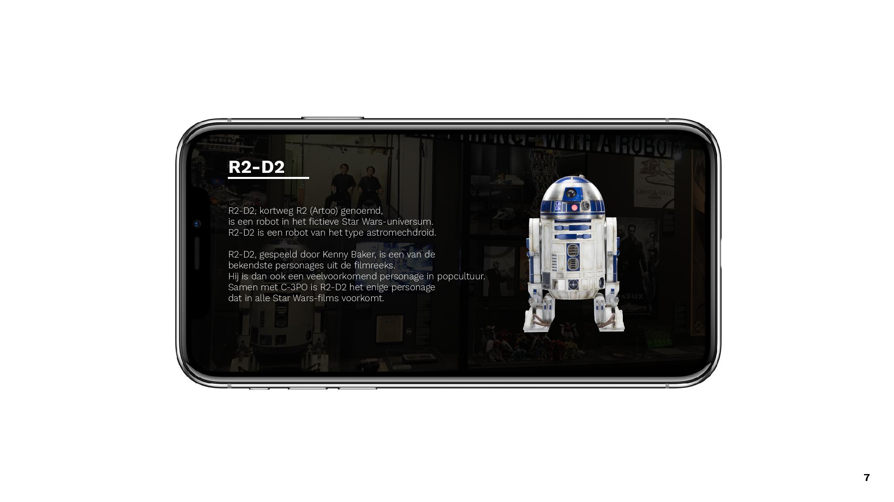

*Voor onze opdracht hebben we als museum Design museum Gent gekozen.*

**Hun huidige voorstelling gaat over de geschiedenis en toekomst van robots. Met een paar richtvragen zoals:**
 - Have you ever met a robot?
 - What was your first experience with a robot?
 - Do we really need robots?

Bij elke robot hangt er een plakaatje met uitleg over wat de robot doet, waartoe hij dient & wie de uitvinders/makers ervan zijn. Bij onze museumervaring en wat bleek uit onze interviews waren deze bordjes nogal saai om te lezen. Dit zagen we als een kans op verbetering. Voor ons concept zouden we voor iedere robot een beacon stellen dat je moet syncroniseren met je smartphone, een melding verscheind eens je in de buurt komt. Eens gesyncroniseerd zou er een scherm opduiken dat korte informatie weergeeft en een korte video van de robot in werking (of in gebruik).

We hadden ons idee voor de smartphone, er ontbrak nog iets, dat extra tikkeltje plezier. Hier komt de smartwatch goed bij te pas! Ons concept is gebaseerd op de pokédex uit Pokémon, dit is een concept uit de jaren ‘90 dat we zouden moderniseren met behulp van een smartwatch. Per gesyncroniseerde beacon komt er dus niet alleen een korte video en een beschrijving maar je voegt zo ook deze robot toe aan je collectie! Als je alle robot’s “gevangen” hebt verkrijg je je eigen persoonlijke code dat je kan gebruiken in de wedstrijd. Wie gewonnen is krijgt een prijs, een kwalitatieve figurine van hun favoriete robot!

### Concept: Hello, ROBOT! Pokémon edition.

## Elevator Pitch

